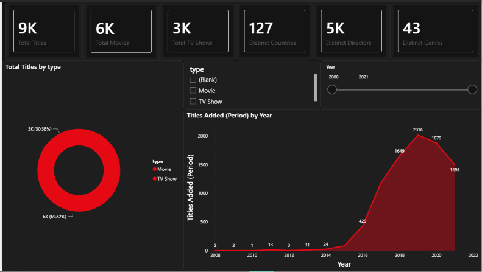

# 🎬 Netflix Content Analysis

An end-to-end data analytics project exploring **8,807 Netflix titles** (6,131 Movies + 2,676 TV Shows) across Python, MySQL, and Power BI. The project covers data cleaning, exploratory analysis, SQL business queries, and a 5-page interactive dashboard — demonstrating a complete analyst workflow from raw data to insight.

---

## 📊 Key Findings

- **70% Movies, 30% TV Shows** — Netflix remains movie-dominated despite the streaming shift
- **United States leads** with the highest title count; India is a distant second
- **2019–2020 were peak content years** — over 1,800+ titles added each year, followed by a sharp drop in 2021
- **TV-MA dominates ratings** at 3,200+ titles, confirming Netflix's adult-first content strategy
- **Dramas and Comedies** are the top two genres across both content types
- Median movie runtime is **98 minutes**; average is **99.53 minutes**
- **127 countries** represented across the catalog; **5K+ distinct directors**

---

## 🗂️ Project Workflow

```
Raw Dataset (netflix_titles.csv)
        ↓
Data Cleaning & Feature Engineering (Python / Pandas)
        ↓
Exploratory Data Analysis (Python — Matplotlib / Seaborn)
        ↓
SQL Business Queries (MySQL / MariaDB)
        ↓
5-Page Interactive Dashboard (Power BI)
```

---

## 🛠️ Tools & Technologies

| Layer | Tool |
|-------|------|
| Data Cleaning & EDA | Python, Pandas, NumPy, Matplotlib, Seaborn |
| SQL Analysis | MySQL / MariaDB |
| Dashboard | Power BI Desktop (DAX, Power Query) |
| Dataset | Kaggle — Netflix Movies and TV Shows |

---

## 📸 Dashboard Preview

### Page 1 – Overview & KPIs
> KPI cards (9K Titles, 6K Movies, 3K TV Shows, 127 Countries, 5K Directors, 43 Genres), content type donut chart (69.62% Movie / 30.38% TV Show), and titles added by year trend showing Netflix's content explosion from 2016 to 2020.



---

### Page 2 – Country Analysis
> Stacked bar chart showing Movie vs TV Show split by country, total titles by country bar chart, and a TV-MA share % table for country-level maturity analysis.


---

### Page 3 – Genre Analysis
> Top genres by total titles bar chart and a multi-line trend showing genre-wise content growth from 2008–2021, with year and type slicers for dynamic filtering.


---

### Page 4 – Ratings & Duration
> Total titles by rating (TV-MA at 3.2K dominates), KPI cards for median (98 min) and average (99.53 min) movie duration, rating × type clustered bar, and a duration bucket histogram.


---

### Page 5 – Director & Monthly Trends
> Top directors bar chart, a month × year matrix showing titles added per month (2008–2021), and Movie vs TV Show ratio cards.


---

## 📂 Repository Structure

```
netflix-content-analysis/
│
├── data/
│   ├── netflix_titles.csv              # Original raw dataset
│   ├── netflix_cleaned.csv             # Cleaned & feature-engineered dataset
│   ├── netflix_countries.csv           # Exploded country-level table
│   └── netflix_genres.csv              # Exploded genre-level table
│
├── notebook/
│   └── netflix_python.ipynb            # EDA notebook (Python)
│
├── sql/
│   └── Netflix_EDA_Queries_LEAN.sql    # Business queries (MySQL/MariaDB)
│
├── powerbi/
│   └── Netflix_PowerBI_Dashboard.pbix
│
├── screenshots/
│   ├── Netflix_1.png                   # Overview & KPIs
│   ├── Netflix_2.png                   # Country Analysis
│   ├── Netflix_3.png                   # Genre Analysis
│   ├── Netflix_4.png                   # Ratings & Duration
│   └── Netflix_5.png                   # Director & Monthly Trends
│
└── README.md
```

---

## 🔍 Analysis Covered

**Python (EDA Notebook)**
- Missing value treatment and imputation
- Feature engineering: `primary_country`, `primary_genre`, `year_added`, `month_added`, `duration_int`, `duration_bucket`
- Content type distribution (Movies vs TV Shows)
- Country-wise and genre-wise breakdown
- Release year and content addition trends
- Rating distribution analysis
- Director frequency analysis

**SQL (MySQL / MariaDB)**
- Content split by type and rating
- Year-on-year content addition trends
- Top producing countries and genres
- Duration analysis for movies vs TV shows
- Window functions for ranking and running totals

**Power BI (5-Page Dashboard)**
- Dynamic slicers: Year range (2008–2021) and Content Type
- KPI cards, donut charts, bar charts, area charts, matrix tables
- Duration bucket histogram for movie length distribution
- TV-MA share % by country (custom DAX measure)
- Month × Year content addition heatmap matrix

---

## 📁 Dataset

- **Source:** [Kaggle – Netflix Movies and TV Shows](https://www.kaggle.com/datasets/shivamb/netflix-shows)
- **Size:** 8,807 titles
- **Coverage:** 1925–2021, 127 countries
- **Columns:** title, type, country, date_added, release_year, rating, duration, listed_in, director, cast

---

## ⚠️ Disclosure

The Python notebook and Power BI dashboard were built independently. The SQL file was generated with AI assistance (Claude) and reviewed for correctness — particularly for MariaDB dialect compatibility (window functions, LOAD DATA INFILE, integer division handling).

---

## 🚀 How to Run

**Python Notebook**
```bash
pip install pandas numpy matplotlib seaborn jupyter
jupyter notebook notebook/netflix_python.ipynb
```

**SQL**
1. Import `netflix_titles.csv` using the LOAD DATA INFILE block at the top of the SQL file
2. Run queries sequentially in MySQL Workbench or DBeaver (MySQL 8.0+ / MariaDB 10.5+)

**Power BI**
Open `powerbi/Netflix_PowerBI_Dashboard.pbix` in Power BI Desktop. If prompted, re-point the data source to `data/netflix_cleaned.csv`.

---

## 👤 Author

**Manish**
B.Tech CSE | Aspiring Data Analyst | Python · SQL · Power BI

[](https://www.linkedin.com/in/manish-kumar-b6b1623b1/)
[](https://github.com/Manish-9770)

